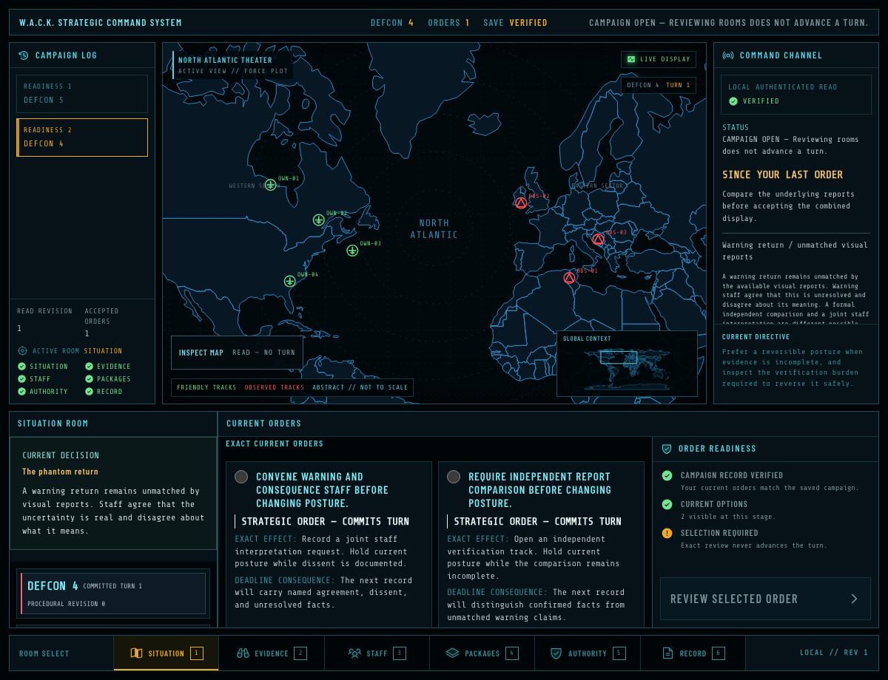

# W.A.C.K. — Strategic Command System

An original single-player Cold War strategy game. Read conflicting reports, weigh your advisers' recommendations, and decide how to respond as a military crisis unfolds.

**[Play W.A.C.K.](https://peteconnorctg.github.io/wack-strategic-command/)** · **[Read the Player's Handbook (PDF)](https://peteconnorctg.github.io/wack-strategic-command/docs/WACK-Players-Handbook.pdf)**

## Getting started

Open the game in your browser and select **START NEW CAMPAIGN**. After the startup checks, select **CONTINUE CAMPAIGN**. The handbook introduces your role and walks through your first decision. No account or installation is required.

## Saving your progress

Saves are stored locally in this browser for this website. They do not automatically transfer from localhost, another website, browser, or device. Clearing browser site data can remove saves.

Use a normal browser window rather than private browsing, and wait for the game to confirm that your order is saved before closing.

## What's in this repository

- `index.html` and `assets/`: the playable browser release.
- [`docs/WACK-Players-Handbook.pdf`](docs/WACK-Players-Handbook.pdf): the illustrated player guide.
- [`THIRD-PARTY-NOTICES.txt`](THIRD-PARTY-NOTICES.txt): third-party licenses and attribution.

## Releases and feedback

See [release notes](https://github.com/peteconnorCTG/wack-strategic-command/releases) for published versions and downloads.

Found something that does not work? [Report a problem](https://github.com/peteconnorCTG/wack-strategic-command/issues/new?template=bug_report.yml). Include your browser, the steps that led to the problem, and what you expected. Reports are public; do not include personal information or unredacted saved records.

This repository contains compiled distribution files, not the source development repository. Browser-delivered code and content are publicly inspectable. Publication does not grant a license to the original game source or content. Third-party license terms and attribution are retained in the notices linked above.
